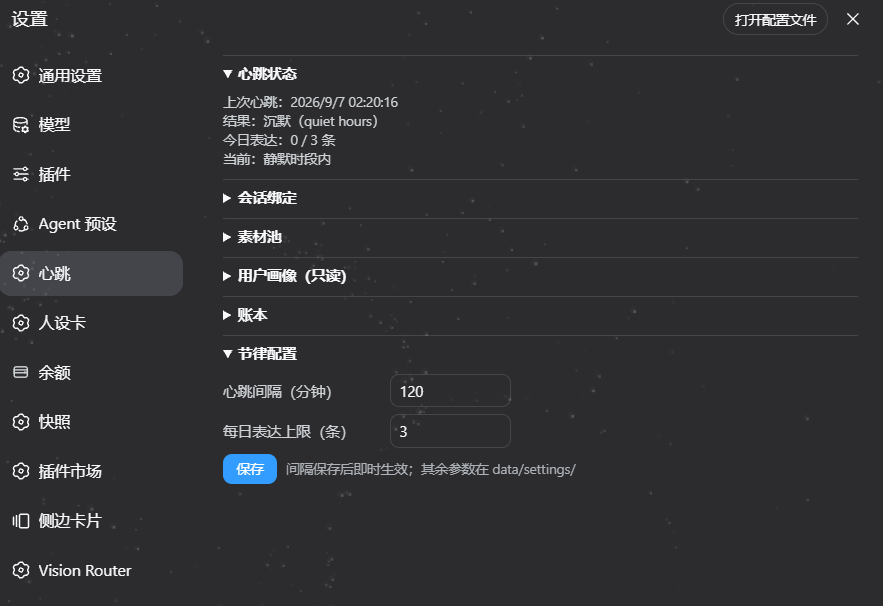

# dsh-heartbeat

> 让 DeepSeek Harness Agent 拥有持续存在感与自主生活流的心跳插件。
> 她能自己醒来、维护自己的记忆与画像、感知环境与忙闲、按分寸决定是否开口——开口要有真实来处，沉默要有具体理由。

[](https://github.com/deepseek-ai/deepseek-harness)
[]()
[]()

> **v1.1 = 给新版宿主的版本**：需要 **DSH ≥ `0.1.2-rc.1`**。
> 还在旧版 DSH（`≤ 0.1.1-rc.2`）上跑的话，请用 [**v1.0**](https://github.com/Kanadego/dsh-heartbeat/releases/tag/v1.0.0)——v1.1 依赖新宿主的 `snapshotEvents()` 与 agent 预设机制，装到旧宿主上跑不起来。

| 插件版本 | 适配的 DSH |
|---|---|
| **v1.1**（当前） | ≥ `0.1.2-rc.1` |
| v1.0 | ≤ `0.1.1-rc.2` |

> 两个版本都需要**心跳预设**：v1.1 会在插件首次启动时自动装好（见〈安装〉）；v1.0 要手动复制一次。
> 没有它，心跳 agent 是个"裸 agent"——工具面对空全局层求值，连 `web_search` 都看不见。

---

## 这是什么

一个 DeepSeek Harness 插件：定时唤醒 agent（出厂默认 20 分钟一跳，设置页可调），按七相循环运行——

```
维护（素材池 gc / 日志保留 / 画像合并）→ 采集（屏幕 / 温度计 / 追踪）
→ 闲逛（按兴趣搜网，结果代码入池）→ 闸门（静默窗/忙时/每日上限/冷却）
→ Digest（处境+画像+素材 现拼）→ 聚焦推理（说不说/说什么/怎么说）
→ 投递（专用心跳会话 + toast 提示）→ 留痕（每跳可审计）
```

核心设计（详见 [DESIGN.md](DESIGN.md)）：

- **分寸优先，不是沉默优先**：闸门前置，SILENT 轮零模型调用；决策轮的默认倾向是开口——
  每天至少说一句，除非他正忙或已到深夜。那条底线没变："没有真实来处的话，一句都别说"
- **素材池是缓存不是记忆**：TTL/消费退休/冷板凳/容量挤出四条确定性淘汰，画像单向隔离
- **用户画像**：本地结构化档案（兴趣/项目/沟通偏好/心理基线），bi-temporal + 来源强制，
  stable/volatile 分档（稳定特质不因时间遗忘），journal 单一权威可重建
- **分寸闸门**：独立层、可审计——静默窗/忙时窗口类别/每日上限/冷却/在场联动
- **隐私**：全部本地；敏感文件 DPAPI（CurrentUser）加密；一键焚毁；路径守卫 + 模型工具硬限制

## 安装 / 卸载

```powershell
# 装插件（构建产物随包分发，无需本地构建）——预设会在插件首次启动时自动装好
dsh plugin --profile web add file:D:/path/to/dsh-heartbeat

# 卸载（插件本体干净移除；data/ 用户数据默认保留，--purge 才连删）
dsh plugin --profile web remove dsh-heartbeat
```

**预设是自动装的**：插件启动时会检查 `<DSH_HOME>/.agent-presets/heartbeat/`——没有就按包内模板 `assets/presets/heartbeat/`
建好（`agent.cordis.yml` + `preset.yml`），并且**已有文件永不覆写**（你自己改过的预设会被原样保留）。
不需要任何手动复制；不想要这个行为就把插件 config 的 `installPreset` 设为 `false`。

想手动检查或修复，用随包的 CLI：

```powershell
$env:HEARTBEAT_DATA_DIR = "<插件目录>\data"     # 与插件 config 的 dataDir 一致
node <插件目录>\dist\cli\index.js preset status          # 装没装、跟模板是否一致
node <插件目录>\dist\cli\index.js preset install         # 补装缺失的
node <插件目录>\dist\cli\index.js preset install --force # 手改坏了、要还原成模板时用
```

**为什么要有预设**：心跳 agent 由宿主 `agents` 服务创建，**不经过会话启动选择器**，所以它默认不加入任何预设——
而"没加入预设的 agent，其工具、prompt 段与技能目录一律对空全局层求值"。结果就是它看不到 `web_search`，
闲逛相只能返回空素材。预设把这层补齐，同时把它的活法钉死：**只有 `tool-web` 一个工具 + `compaction` 折叠组**，
没有 shell、文件、子代理、todo、skill。模板由随附的 `standard` 预设裁剪而来，随包在 `assets/presets/heartbeat/`；
预设 id 可用插件 config 的 `agentPreset` 改。装好后审计日志里应出现 `preset_install` 与 `preset=mounted(heartbeat) restrict=ok`——那就是成功了。

重启 DSH 后生效。插件自动创建**专用心跳会话**并开始按节律运行。

## 使用

日常无需任何操作。**设置页 → 心跳** 卡片（截图见下）提供六个分区，全部鼠标操作：

| 分区 | 内容 |
|---|---|
| 心跳状态 | 上次心跳时间 / 结果（沉默原因或开口摘要）/ 今日表达计数 / 当前是否静默时段 |
| 会话绑定 | 列出持久化会话（含会话名与 live 标记）；**投递 / 观察是两个独立开关**——同一会话可双开，行内逐个切换（`☑投递 ☐观察`），两个都关即解绑 |
| 素材池 | 列表、归档/恢复/删除素材（删除需二次确认） |
| 用户画像（只读） | 画像摘要 + 导出（解密导出 Markdown 供人审） |
| 账本 | 打开账本（host 拉起编辑器，只读快捷方式） |
| 节律配置 | 心跳间隔（分钟）/ 每日表达上限（条）→ 保存；间隔即时生效 |



（截图摄于 v1.0；v1.1 的「会话绑定」分区在同一行上多了**投递 / 观察**两个独立开关。）

CLI 依然可用（高级/脚本场景）：

```powershell
node <插件目录>/dist/cli/index.js status        # 运行状态摘要
node <插件目录>/dist/cli/index.js seeds stats   # 素材池统计
node <插件目录>/dist/cli/index.js profile export  # 画像解密导出（人可审）
node <插件目录>/dist/cli/index.js ledger list --pending  # 账本待办
```

**主动投递与观察**：把心跳消息送进你常用的会话 / 让会话内容变成画像素材：

```powershell
node dist/cli/index.js sessions list              # 枚举会话 id
node dist/cli/index.js bind add session-xxxx      # 绑定投递（agent开口也会说到那里）
node dist/cli/index.js bind add session-xxxx --observe      # 投递 + 观察（双开）
node dist/cli/index.js bind add session-xxxx --observe-only # 仅观察（关掉投递）
node dist/cli/index.js bind list                  # 查看当前绑定（deliver:√/× observe:√/×）
node dist/cli/index.js bind remove session-xxxx   # 解绑
```

投递目标没有活着的 agent（例如刚重启过、那个会话还没被打开）时，心跳会**先把它 resume 起来**再投递；
只有确实拉不起来才回落到引擎室正身，并在审计里留一行 `spoke_fallback`——不会静默改道。

## 配置

三层优先级（低→高）：**出厂默认**（包内 `config/`，只读）→ **用户文件层**（`data/settings/policy.json`，deepMerge）→ **设置页**（间隔/上限，间隔即时生效并重排定时器）。

出厂默认值速览（完整表见 [DESIGN.md §6](DESIGN.md)）：

| 参数 | 出厂默认 |
|---|---|
| 心跳间隔 | 20 分钟；首跳 boot+15s |
| 每日表达上限 | 3 条（成功投递才计数） |
| 静默时段 | 01:00 – 08:00；冷却 30 分钟 |
| 闲逛窗口 | 11:00–15:00 / 17:00–21:00，≥4h 间隔 |
| 素材池上限 / TTL | 30 条活跃；news 3 / fandom 14 / scene 60 / promise 90 天 |
| 画像容量 / 触发 | 50 / 分区；合并触发 12–24h 或积压 30 条 |
| 日志保留 | envpulse 流 48h；决策日志 30 天 |

| 常用参数 | 位置 |
|---|---|
| 静默时段 / 冷却 / 素材池上限 / TTL 阶梯 / 画像分区容量 | `data/settings/policy.json`（只写要覆盖的子键） |
| 画像能记什么（隐私白名单） | `data/settings/profile-schema.json` |
| 追踪哪些 npm/GitHub / 兴趣种子 | `config/watchlist.json`、`config/interests.json`（用户层同名文件整体替换） |
| 忙闲类别表（哪些进程算忙） | `config/busy-rules.json` |
| 心跳 agent 加入的预设 id（默认 `heartbeat`） | 插件 config（profile 的 `cordis.patch.yml` heartbeat 行 → `agentPreset`） |
| 是否自动安装随包预设（默认 `true`） | 插件 config → `installPreset`（设为 `false` 即完全不管预设目录） |

## 数据与隐私

- 全部运行数据在 `data/`（唯一可写目录，路径守卫强制）：清单与格式见 [DESIGN.md §5](DESIGN.md)
- 加密（DPAPI，CurrentUser，防他人/他机/误同步，不防同账户恶意软件）：
  素材池、屏幕快照、表达记录、画像三件套、浏览流状态
- 明文（透明度设计）：账本、作息聚合、审计日志（不含敏感原文）
- 模型出库仅限合并裁决的最小必要摘要（不含 psy、不含原文），知情同意设计
- 一键焚毁：`node dist/cli/index.js burn`（预演）→ `burn --yes`（覆写 x3 + 删除，设置保留）；`--all` 连设置归零

## 诊断

第一现场：`data/logs/heartbeat.jsonl`（每跳留痕，silent 必带原因）。
事件字典、症状→排查表、宿主契约备忘见 [DESIGN.md §7](DESIGN.md)；画像完整性用 `profile verify`。

## 开发

```powershell
npm install
npm run build        # tsup → dist/
npm run typecheck
npm test             # 99 个单元测试（判定逻辑全注入时间，无 sleep）
```

工程细节（宿主契约实测备忘、模块实现、踩坑记录）见 [DESIGN.md](DESIGN.md)。

## 更新日志

### v1.1 · 2026-09-10

这是**给新版宿主的版本**（DSH ≥ `0.1.2-rc.1`）：旧宿主请留在 v1.0。同时修掉几个把心跳按哑的 bug。
安装只需一条 `dsh plugin add`——**心跳预设由插件首次启动时自动装好**（已存在就一个字节都不动）。
详细的宿主契约变更见 [DESIGN.md §3](DESIGN.md) 与 §15。

**兼容性（DSH 0.1.1-rc.2 → 0.1.2-rc.1）**

| 宿主变化 | 症状 | 处理 |
|---|---|---|
| `Session.events` 被移除，改 `snapshotEvents()` / `seq` | 每跳在 `agent.session.events.length` 上抛 `TypeError: Cannot read properties of undefined (reading 'length')`，整跳 `beat_error`、合并 `consolidation_failed` | 新增 `sessionEvents()` / `sessionEventCount()` 兼容层：优先 `snapshotEvents()`，缺失才回退 `events` |
| `agents.create/resume` 不再代填部署默认模型 | agent 的 `options.model` 为 undefined → 每次 prompt 组装抛 `prompt variable "{{model}}" has no value for this assembly (section "deployment:persona")`，所有轮次在起点就死 | 新增 `defaultAgentOptions(ctx)`：读 `agentDefaultModel.currentSelection()`，显式传 `agentOptions` |
| 未加入预设的 agent 只能看到空全局层 | `tools.restrict({allow:['web_search']})` 抛 `unknown global tool "web_search"`；闲逛相搜不了，只能返回 `{"items":[]}` | 新增**心跳预设**：`setup` 里 `agentPresets.mount(agentCtx, id)`，随包提供 `assets/presets/heartbeat/`，**首次启动自动装到 `~/.dsh/.agent-presets/heartbeat/`** |
| client 模块注册 id 必须严格等于包名 | id 不一致的包被从 client 组合里**静默剔除**：设置页心跳区块整块消失，host 侧却照常运行 | `client.js` 注册 id 与 `cordis.patch.yml` 的 insert name 统一为 `@Kanadego/dsh-heartbeat` |
| 会话标题迁到 per-record 投影缓存 | 卡片把会话显示成 `session-c9ba6998…` 而不是会话名 | 标题改读 `~/.dsh/storages/session_projcache/sessions/<id>.json`，旧的单文件聚合只作兼容回退 |
| 前端 bundle 启动即读入内存、响应标 immutable，且无文件监听 | 改 `client.js` 后刷新页面拿不到新代码 | 前端改动必须重启 DSH（已写进文档） |

**功能改进**

- **开口倾向**：决策相从"沉默是常态"改为"分寸优先"——默认倾向开口，只有在"素材都用过确实没新话""距上次开口太近""他显然在忙""已到深夜"时才沉默；提示词里带上"今天已开口 N 次（上限 M）/ 上次开口是 X 分钟前"，当天一次都没说过时明确要求挑一句说。
- **投递文本**：改为一句极短的舞台提示（`（此刻你想说的一句话，用中文直接说出来，不要提及本行。）`），不再在正文里暴露"心跳投递/引擎室"这类机器细节——来源仍完整声明在消息的 `source` 元数据里，轨迹视图会标成 `plugin: heartbeat`。
- **会话绑定可双开**：卡片的已绑定行新增 `☑投递 ☐观察` 两个独立开关（原来绑了投递就再也点不到"绑定观察"），未绑定列表增加一次「投递+观察」入口。
- **投递目标自动拉活**：目标会话在本进程没有活 agent（重启后未被打开）时按需 `agents.resume`，不再默默说在自己房间里。
- **审计更细**：新增 `deliver_target_live` / `deliver_target_resumed` / `deliver_target_resume_failed` / `spoke_fallback` / `spoke_deferred`；`turn_extraction_empty` 增加 `turnError` 字段（模型输出的终止错误原因）。
- **预设自动安装**：插件启动时按 `agentPresets.roots` 找到真正的用户预设根，缺失就按包内模板补齐（审计打 `preset_install`）；**已有 composition 文件永不覆写**，手改过的自定义预设会被完整保留。CLI 加了 `preset status` / `preset install [--force]` 供人工检查修复——安装从"三步手工复制"变成"一条 add"。

**Bug 修复**

- 模型输出里的 `reasoning` 块被当成正文拼接，导致 `{"speak":false}` 之类的 JSON 被解析成 `…{...}{...}`，抛 `SyntaxError: Unexpected non-whitespace character after JSON at position 15` → `assistantText()` 现在排除 reasoning 块，`parseJsonBlock()` 双循环枚举括号候选取第一个可解析对象（`profile/consolidate.ts` 的 `parseOps()` 同样容错化）。
- 表达轮 `whenIdle` 超时会把整跳打成 `beat_error`（现场只差 20 秒）→ 表达轮等待放宽到 10 分钟，失败记 `spoke_deferred`，那句话留到下一跳，不再污染整跳结果。
- 工具策略自愈逻辑曾从报错文本里用 `/search/i` 抓了个名字重试，抓到的是 ACP 的 `search_context`（搜对话块，与联网无关）**而且成功生效**，把 agent 掩蔽到只剩一个无用工具 → 已删除该回退，`restrict` 失败只如实记录。
- 心跳 agent 的 `tool_policy` 审计行里 `visible=` 改名 `visibleGlobal=`：`tools.schemas()` 不带 scope 参数拿的是**全局视图**，它本来就不该用来判断预设是否挂上（判据是同一行的 `restrict=ok`）。

### v1.0.0 · 2026-09-05

首个正式版：七相主循环、素材池/画像/闸门、DPAPI 加密与焚毁、审计留痕，以及 M6 的设置页六分区卡片与 `/heartbeat` RPC 通道。

## 致谢

- [tomsteve1102/presence-watch](https://github.com/tomsteve1102/presence-watch) — 讨论起点与闸门思想
- 前代项目 [kohaku-heartbeat](https://github.com/Kanadego/kohaku-heartbeat) — v1 脚本外挂形态，本项目为其插件化重构

## 许可

[MIT](LICENSE)