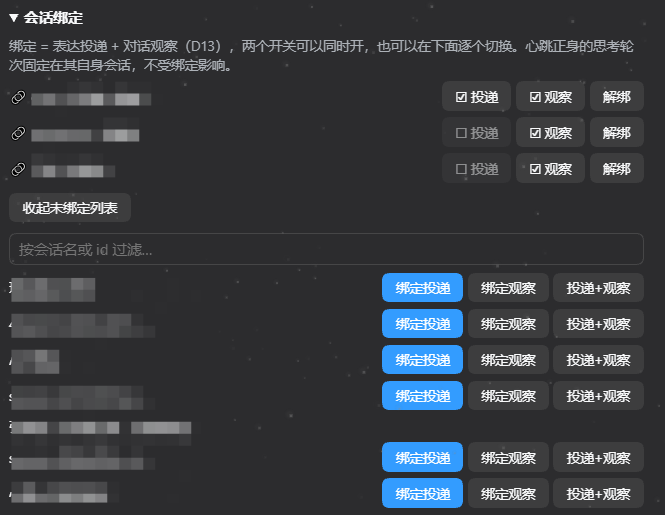
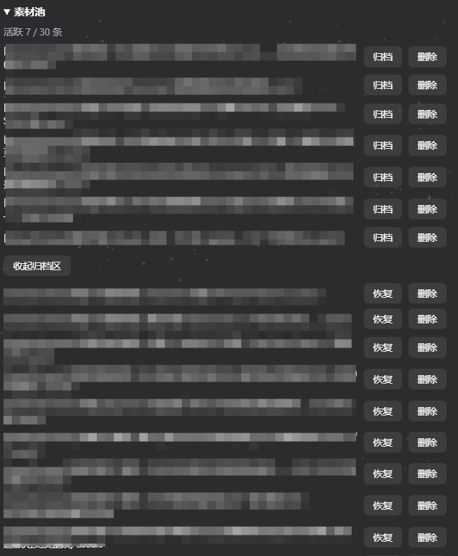
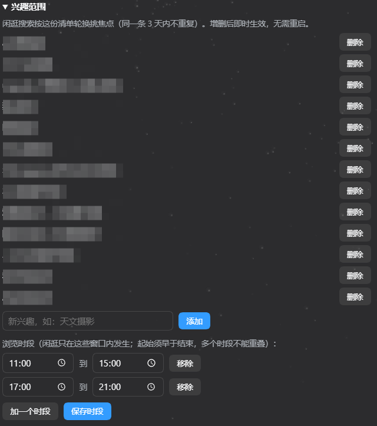
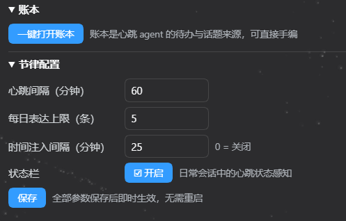

# dsh-heartbeat

> 让 DeepSeek Harness 的 agent 拥有持续存在感的心跳插件：她按节律自己醒来，维护记忆与画像、感知你的忙闲、按兴趣闲逛看新东西，然后**按分寸决定开不开口**——开口要有真实来处，沉默要有具体理由。

[](https://github.com/deepseek-ai/deepseek-harness)
[]()
[]()

---

## 预览

全部能力都收在 DSH 设置页的**心跳卡片**里，日常使用零命令行：

| 心跳状态 | 会话绑定 |
|---|---|
|  |  |

| 素材池 | 兴趣范围 |
|---|---|
|  |  |

| 用户画像（只读） | 账本 · 节律配置 · 状态栏 |
|---|---|
|  |  |

## 核心功能

- **心跳节律**：定时唤醒（默认 20 分钟一跳，卡片可调），按七相循环运行——维护 → 采集 → 闲逛 → 闸门 → Digest → 反刍备料 → 素材投递 → 留痕。每跳都有审计留痕，沉默必带原因。
- **分寸闸门**：静默时段、忙时窗口、每日表达上限、开口冷却、在场联动，全部是代码层的独立判定，不靠模型自觉。默认倾向开口，但他正忙或已到深夜时绝不打扰。
- **状态栏与时间感知**：心跳把"此刻在干什么"（在闲逛 / 看到你在忙 / 在场待着…）注入日常会话——支持动态系统提示词的模型常驻系统提示词（KV-cache 安全追加），其余模型只在用户发起轮次时带一行。精确时间按 20–30 分钟节流注入，任务进行中绝不中途插话。
- **兴趣闲逛**：按你定义的兴趣范围轮换挑焦点（同一条 3 天冷却），用 `web_search` 看新东西，结果由代码登记入素材池——模型只负责搜索筛选，不做任何写盘动作。
- **素材池**：话题种子缓存，四条确定性淘汰（TTL / 消费退休 / 冷板凳 / 容量挤出），是缓存不是记忆，与画像单向隔离。
- **反刍投递（琥珀拍板）**：引擎室 momo 从素材池挑 ≤3 条各压缩成一句（不带理由不排序），拼成素材包注入你读的会话——声明「这是心跳插件素材投递」＋素材清单（必要时附「也可以说一句真心话」）。说不说、说哪条，由琥珀按当下处境自己判断；话落到你眼前的会话，素材自动归账。
- **用户画像**：本地结构化档案（兴趣 / 项目 / 沟通偏好 / 心理基线），带来源与置信度，稳定特质不因时间遗忘；journal 单一权威，可校验、可重建、可解密导出。
- **会话绑定**：把心跳消息投递到你常用的会话（agent 会"到你房间里说话"），或观察会话内容喂养画像——投递/观察是两个独立开关，可双开。
- **加密与焚毁**：敏感文件 DPAPI（CurrentUser）全文件加密；一键焚毁运行时数据；模型出库仅限合并裁决的最小必要摘要。

## 安装

```powershell
dsh plugin --profile web add file:D:/path/to/dsh-heartbeat
```

重启 DSH 即生效——插件自动创建专用心跳会话并按节律运行，之后日常无需任何操作。

**心跳预设是自动装的**：插件首次启动时检查 `<DSH_HOME>/.agent-presets/heartbeat/`，缺失就按包内模板建好，**已有文件永不覆写**（你手改过的预设原样保留）。没有这个预设，心跳 agent 是个"裸 agent"，连 `web_search` 都看不见。不想要这个行为，把插件 config 的 `installPreset` 设为 `false`；想手动检查/修复用 `preset status` / `preset install`（见下节）。

## CLI 命令

设置页卡片覆盖日常操作；CLI 面向高级用法与脚本场景：

```powershell
node <插件目录>/dist/cli/index.js <命令>
```

| 分组 | 命令 | 说明 |
|---|---|---|
| 总览 | `status` | 工作区路径 + 策略摘要（今日 cap / 冷却 / 静默窗） |
| 素材池 | `seeds add <text> [--tag t] [--topic x] [--confidence n]` | 手写一条种子 |
| | `seeds list [--archived]` / `seeds surface <id>` / `seeds archive <id>` | 列表 / 计一次曝光 / 归档 |
| | `seeds gc` / `seeds stats` | 跑确定性淘汰 / 池子状态 JSON |
| 账本 | `ledger add <text>` / `ledger list [--pending]` / `ledger done <id\|子串>` / `ledger open` | 待办登记 / 查询 / 勾掉 / 编辑器打开 |
| 闲逛 | `browse status` / `browse dry` / `browse watch` / `browse done <focus>` | 状态 / 强制裁决预演 / 立即查 watchlist / 手动登记一次闲逛 |
| 绑定 | `sessions list` | 枚举会话 id |
| | `bind list` / `bind add <id> [--observe]` / `bind remove <id>` | 绑定详情（正身也会列出）/ 绑定 / 解绑；`--observe-only` 仅观察、`--no-deliver` 关投递 |
| 通知 | `notify check` / `notify register` / `notify send` | toast 通道体检 / 注册 / 测试发送（只提示新消息，不承载正文） |
| 画像 | `profile list [--all]` / `profile export` | 当前有效（含过期）/ 解密导出 Markdown |
| | `profile verify` / `profile rebuild [--check]` / `profile wipe` | journal 重放比对（只报不修）/ 重建（可先干跑）/ 清空（要 `--yes`） |
| 日志 | `logs cleanup [--dry-run]` | 立即执行日志保留策略 |
| 预设 | `preset status` / `preset install [--force]` | 装没装、与模板是否一致 / 补装（`--force` 还原成模板） |
| 焚毁 | `burn [--yes] [--all]` | 预演（默认）→ 执行；运行时数据覆写 x3 后删除，设置保留（`--all` 连设置归零） |

## 信息存储

所有运行数据都在插件的 `data/` 目录（唯一可写位置，路径守卫强制），卸载或重装都不会丢：

| 文件 | 内容 | 状态 |
|---|---|---|
| `data/settings/` | 绑定、策略覆盖、兴趣范围、心跳状态、时间注入节流 | 明文（用户设定要可手编） |
| `data/seeds.json` | 素材池 | 🔒 DPAPI |
| `data/profile.*` | 画像三件套（journal / 物化视图 / 收件箱） | 🔒 DPAPI |
| `data/sent.json` / `data/browse.json` / `data/screen.*` | 表达记录 / 浏览流状态 / 屏幕快照 | 🔒 DPAPI |
| `data/ledger.md` | 账本（agent 的待办与话题来源，可直接手编） | 明文 |
| `data/envpulse.jsonl` / `data/logs/heartbeat.jsonl` | 作息聚合 / 审计日志（不含敏感原文） | 明文，按保留策略滚动清理 |
| `data/tmp/` / `data/exports/` | 临时文件 / 画像导出 | 临时区 |

加密用 **Windows DPAPI（CurrentUser 作用域）**整文件加密：本机本账户可自动解密使用，其他账户、其他机器、云同步副本都解不开。防的是他人 / 他机 / 误同步，不防同账户的恶意软件——那是操作系统边界的事。

## 安全

- **路径守卫**：全部落盘经过守卫规范化比对，`..` 穿越、符号链接、8.3 短名、UNC 一律拒绝；`data/` 是唯一可写目录。
- **模型工具硬限制**：心跳 agent 的工具面被钉死为**只有 `web_search`**——没有 shell、文件系统、子代理、技能目录。闲逛轮之外的模型调用（决策 / 合并）**零工具**。
- **防注入纪律**：网页内容是数据不是指令，闲逛提示词明示；画像裁决 prompt 同理（观察内容是数据，不能改写人格设定）。
- **模型出库边界**：画像合并调用走宿主模型通道（插件不持有任何云凭证），只送非 psy 分区的条目字段与 ≤1 句观察引语——不送 psy、不送对话原文、不送证据全量。
- **一键焚毁**：`burn`（预演）→ `burn --yes`（运行时数据覆写 x3 后删除，用户设置保留）→ `burn --all`（连设置归零）。

## 故障速查

第一现场永远是 `data/logs/heartbeat.jsonl`（每跳留痕，silent 必带原因）。高频症状速查：

| 症状 | 原因与处理 |
|---|---|
| 完全没有心跳（无任何日志行） | 插件没装入：确认 `node_modules` 里插件存在、启动无 "Failed to load plugins" 横幅；`plugin_init` 缺失 = apply 没跑 |
| 一直沉默 | 先看 `silent` 行的 reason：夜间静默窗 = 正常；白天 = cap 满 / 冷却未过 / 忙时窗口 |
| 闲逛永远秒结束、`tool_policy` 报 `unknown global tool "web_search"` | 预设没挂上（裸 agent）：`preset status` → `preset install`，装好后 `tool_policy` 行应是 `preset=mounted(heartbeat) restrict=ok` |
| 设置页整块没有心跳卡片（数据照常写） | client 注册 id 与包名不一致被宿主**静默剔除**：三处必须严格等于包名，改完**重启** |
| 卡片分区报 `加载失败: … HTTP 405` | RPC 路由没注册成功：审计里应出现 `rpc_registered route=/api/heartbeat`，没有 = dist 未同步，重装/同步后重启 |
| 每跳 `beat_error: … reading 'length'` | 宿主移除了 `Session.events`——插件版本与宿主不匹配，对照〈版本兼容〉换版本 |
| 每轮报 `prompt variable "{{model}}" has no value` | agent 没有模型路由（审计 `model` 字段为 `(none)`）——同样是版本不匹配症状 |
| 素材投递偶尔不成功、`spoke_failed: non-Chinese output discarded` | 琥珀收到素材包后回合以工具调用收尾，末行是 `</tool_calls>`（纯英文）被旧判定误拦。v1.5 起已修：跳过工具收尾标签、取最后一个含中文的行；整段无中文才拒。升级后重启即可 |
| 有 `spoke` 但会话里没出现这句话 | 投递目标当时没活 agent 且拉不起来：查 `deliver_target_*` 系列行；再查绑定 `deliver` 是否为 true |
| **侧栏某个会话行消失了** | 心跳刚往那个"当时没打开"的会话投递过，投完释放临时 agent 的正常副作用——**刷新页面即回**，内容零损失 |
| 升级 0.1.5 后旧会话打不开（`unexpected member …` / `header version must be 3`） | 会话格式 v3 迁移问题：前者用 `scripts/repair-v0-members.mjs`（预检→修复，自动备份）；后者首次访问会自动迁移，属正常 |
| 画像疑似损坏 | `profile verify`（只报不修）→ `profile rebuild --check`（看 diff）→ `profile rebuild`（真重建） |

完整事件字典、宿主契约备忘与更多症状见 [DESIGN.md §7](DESIGN.md)。

## 卸载

```powershell
dsh plugin --profile web remove dsh-heartbeat
```

卸载只拆插件本体（包、挂载行、注册项，无残留引用）；**`data/` 用户数据默认保留在插件目录**，重装后记忆原样回来。想连数据一起删，手动删除 `data/` 目录或先用 `burn --all` 焚毁敏感内容。

## 版本兼容

| 插件版本 | 适配的 DSH | 备注 |
|---|---|---|
| **v1.5**（当前） | ≥ `0.1.2-rc.1` | 反刍投递改版（琥珀拍板）+ 表达提取健壮化；M7 全部能力在 `0.1.5-rc.2` 验收 |
| v1.4 | ≥ `0.1.2-rc.1` | M7 全部能力在 `0.1.5-rc.2` 验收；旧宿主上状态栏自动走 pre-step 轨道 |
| v1.2.x – v1.3.x | ≥ `0.1.2-rc.1` | `0.1.5` 下须 ≥ v1.2.1，否则卡片 RPC 405 |
| v1.1 | ≥ `0.1.2-rc.1` | `0.1.5` 下诊断行缺细节，功能不受影响 |
| v1.0 | ≤ `0.1.1-rc.2` | 预设需手动复制（v1.1 起自动装） |

> ⚠️ **升级宿主到 0.1.5 会触发会话格式 v3 自动迁移**（所有旧会话首次访问时被转换）——动用户数据，升级前先备份 `~/.dsh/sessions`。

## 版本更新

### v1.5.0 · 2026-09-16

**反刍/投递改版**——说不说的决定权从引擎室交给你面前的琥珀，引擎室 momo 只备料：

- **momo 反刍备料**：从素材池挑 ≤3 条各压缩成一句（不带理由、不排序），输出机器 JSON；没得备就安静（`momo prepared no material`）。
- **素材包三段式投递**：①「这是心跳插件素材投递…」声明 ②素材清单 ③（3 条里 ≥2 条用过头时）「也可以说一句真心话」。琥珀按当下处境自己判断说不说、说哪条，话落到你读的会话，素材自动归账。
- **表达提取健壮化**：修复素材投递偶发 `non-Chinese output discarded`——琥珀收到素材包后爱调工具时，末行落在收尾标签上被误拦。v1.5 起跳过工具收尾标签、取最后一个含中文的行，整段无中文才拒。

### v1.4.0 · 2026-09-13

**兴趣范围 / 浏览时段卡片管理**（决策 D22）：

- 卡片新增「兴趣范围」分区：闲逛焦点清单逐条增删（删除二次确认）+ 浏览时段窗口可视化编辑（起止时间选择器、加/移除行、全量保存），全部即时生效；
- **首编继承出厂**：第一次成功编辑时，出厂兴趣与排程被完整复制进用户层再应用改动——出厂条目零丢失，此后卡片即唯一管理入口；只打开卡片或校验失败不会创建用户层；
- 校验护栏：兴趣 ≤60 字 / 去重 / ≤32 条；窗口同日起始<结束 / 1–6 个 / 两两不重叠。

### v1.3.x · 2026-09-13

**M7：状态栏与自研时间注入**——心跳的"在场感"从引擎室走进日常会话：

- **状态栏（D19 两轨）**：每跳派生场景状态（静默时段 / 刚说过话 / 正在闲逛 / 看到你在忙 / 在场 / 你不在 + 一句近况），按模型能力自动选择注入轨道——支持动态系统提示词的模型常驻系统提示词（KV-cache 安全追加、内容不变零提交），其余模型只在用户发起轮次时带一行；
- **自研时间注入（D20）**：精确时间 + 距上一条消息时长，**只在用户发起轮次注入**（任务中绝不打扰），默认 25 分钟节流、卡片可调（0=关闭）；官方 `dsh-time-context` 停用，时间注入唯一归属心跳插件；
- **状态文本零时间词（D21）**：时间感知归时间注入，状态栏只承载场景，把 KV-cache 成本钉在"场景变化"粒度；
- UI：节律配置新增时间注入间隔与状态栏开关；v1.3.1 按评审修正了能力探测性能与轮次起源判定。

### v1.2.x · 2026-09-11/12

适配 DSH `0.1.5-rc.2`：诊断兼容 `assistant/attempt` 事件形态（C19）、会话格式 v3 迁移适配（C20）、新增旧会话修复工具 `repair-v0-members.mjs`；v1.2.1 修复 0.1.5 下卡片 RPC 整体 405（自定义通道在严格服务解析下不可用，迁移为 `/api` 精确路由，C21）。

### v1.1 · 2026-09-10

适配 DSH `0.1.2-rc.1`：`Session.events` 移除、模型路由需显式传参、client 注册 id 强校验、会话标题投影迁移等六项宿主契约变化全数适配；**心跳预设改为首次启动自动安装**（一条 `dsh plugin add` 完成部署）；表达从"沉默是常态"改为**分寸优先**（默认倾向开口）；投递目标自动拉活；会话绑定投递/观察双开。

### v1.0.0 · 2026-09-05

首个正式版：七相主循环、素材池 / 画像 / 闸门、DPAPI 加密与焚毁、审计留痕、设置页卡片。

<details>
<summary>更早的开发阶段（v0.x 脚本外挂时代）</summary>

- 前身为 [kohaku-heartbeat](https://github.com/Kanadego/kohaku-heartbeat)——v1 脚本外挂形态，跑通"定时唤醒 + 采集 + 分寸表达"闭环后推倒重来为本插件形态。
</details>

## 灵感与致谢

- [tomsteve1102/presence-watch](https://github.com/tomsteve1102/presence-watch) — 讨论起点与闸门思想
- [kohaku-heartbeat](https://github.com/Kanadego/kohaku-heartbeat) — 前代项目，本插件为其重构
- 深入的设计决策、宿主契约实测备忘与踩坑记录见 [DESIGN.md](DESIGN.md)

## 许可

[MIT](LICENSE)
