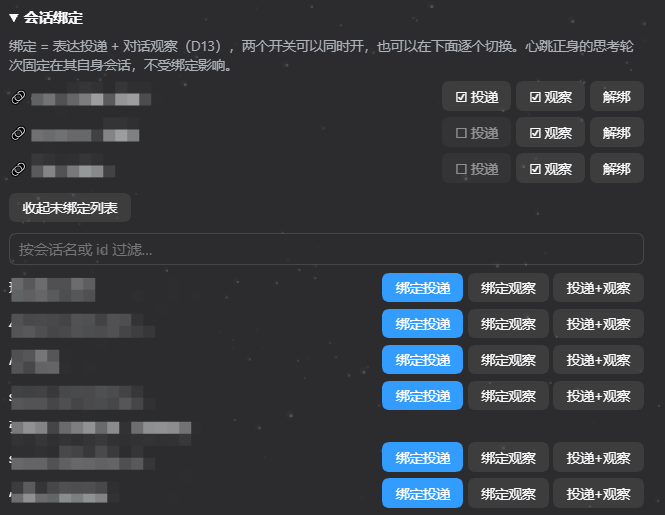
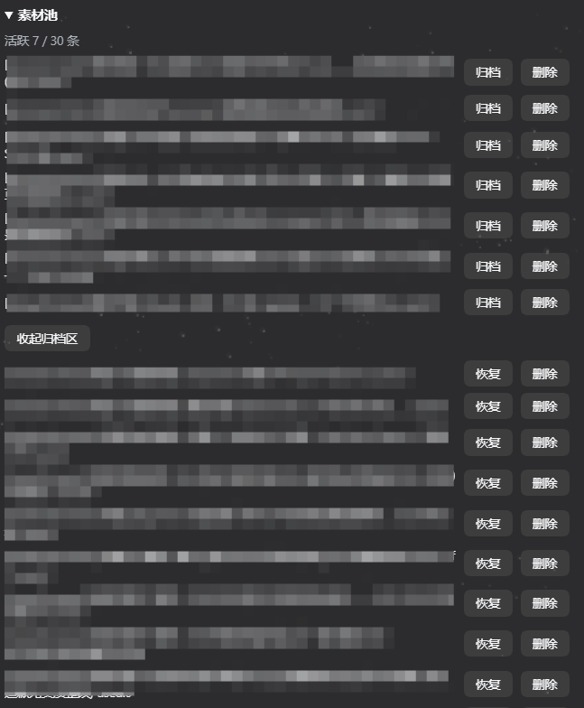
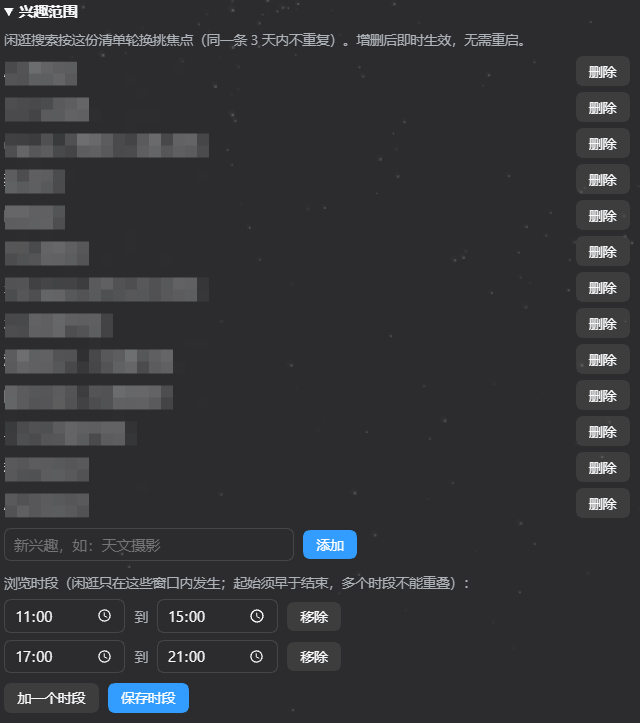
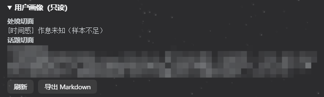
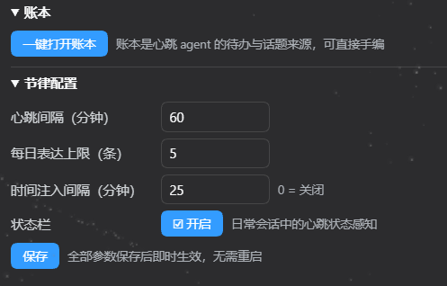

# dsh-heartbeat

> 让 DeepSeek Harness 的 agent 拥有持续存在感的心跳插件：她按节律自己醒来，维护记忆与画像、感知你的忙闲、按兴趣闲逛看新东西，然后**按分寸决定开不开口**——开口要有真实来处，沉默要有具体理由。

[](https://github.com/deepseek-ai/deepseek-harness)
[]()
[]()

---

## 预览

全部能力都收在 DSH 设置页的**心跳卡片**里，日常使用零命令行：

| 心跳状态 | 会话绑定 |
|---|---|
|  |  |

| 素材池 | 兴趣范围 |
|---|---|
|  |  |

| 用户画像（只读） | 账本 · 节律配置 · 状态栏 |
|---|---|
|  |  |

> 截图摄于较早版本；卡片后来还加入了「周报」（v1.8.0）与「换机迁移」（v1.8.0）两个分区。

## 关键概念

文档里反复出现几个词，先在这里一次说清：

| 词 | 意思 |
|---|---|
| **心跳** | 本插件的核心动作——不用你开口，agent 按固定节律自己「醒一次」：做维护、感知环境、决定要不要说话。醒一次叫**一跳**，默认 20 分钟一跳。 |
| **宿主** | 运行插件的那个程序，即 DSH 本体。心跳是挂在宿主里的插件——模型通道、会话、工具这些能力都由宿主提供。 |
| **客户端** | 宿主里负责界面的那一侧（Web 界面或者 DSH desktop）。设置页的心跳卡片属于客户端；卡片显示不出来，通常是客户端插件没加载成功，与心跳本体无关。 |
| **相** | 一跳内部的一个阶段。主循环共七相——维护 → 采集 → 闲逛 → 闸门 → Digest → 反刍备料 → 投递，最后统一由**留痕**收尾。每相结束都会在审计日志留一条 `phase_done`，所以「这一跳停在哪」可以直接查。 |
| **引擎室** | 跑心跳内部轮次的那个 agent，和你在会话里对话的 agent 是分开的。它只负责采集、反刍、备料，**不直接跟你说话**；真正开口的是你读的那个会话里的 agent。 |
| **心跳正身** | 心跳自己专用的一个会话，同时也是它的决策现场——每跳的推理轮次都在这里发生。它在会话列表里和普通会话长得一样，日常不用去动它（CLI 的 `sessions list` 会把它单独标出来）。 |
| **闸门** | 决定「这一跳能不能开口」的纯代码判定层，依次看：静默时段 → 你是不是在忙 → 你在不在场 → 今天说够没有 → 距上次开口够久没。全不通过就安静，并在日志里写下具体原因。它也是省 token 的关键——**判「别说」时，后面的模型调用根本不发生**。 |
| **观察** | 投递的反向动作——把绑定的会话里你新说的话收进**画像收件箱**，作为了解你的证据。它发生在采集相：只取当时有活 agent 的绑定会话、每跳最多 10 条、每条只留第一句（≤80 字），插件自己注入的消息会被跳过。 |
| **反刍** | 投递之前的备料步骤：引擎室从素材池挑出最值得说的几条，各压缩成一句话（不带理由、不排序）。名字取自反刍动物把食物嚼细再咽。 |
| **投递** | 把备好的素材包送进你某个会话的动作。把心跳绑定到常用会话，agent 就会「到你那个房间里说话」。 |

## 核心功能

插件的一切都围绕**一次心跳**展开：不用你开口，agent 按固定节律自己醒过来，走完一轮判断，再决定要不要说话。整体链路：

```
定时器：默认 20 分钟一跳
  │
  ▼
①  维护 ── 清素材池 / 滚动日志 / 判断该不该合并画像
②  采集 ── 全屏截图（加密落盘）+ 忙闲判定 + 前台窗口类别
           ╰─ 观察：把绑定会话里你新说的话收进画像收件箱
②′ 闲逛 ── 条件触发：agent 自己按兴趣焦点用 web_search 看新东西
③  闸门 ── 纯代码判定：静默窗 / 忙时 / 在场 / 每日上限 / 冷却
           ╰─ 判「别说」→ 本跳到此为止，一个 token 都不花
④  Digest ── 拼出「此刻状态」：画像 + 时间 + 素材池 + 待办
⑤  反刍 ── 引擎室从素材池挑 ≤3 条，各压成一句话（备料）
⑥  投递 ── 拼成素材包，送进你指定投递的那个会话
⑦  留痕 ── 写审计日志 + 账本（真正开口了才计数）
  │
  ▼
你读的那个会话 ── 那里的 agent 按当下处境，决定说不说、说哪条
```

- **心跳节律**：定时唤醒（默认 20 分钟一跳，卡片可调），按七相循环运行——维护 → 采集 → 闲逛 → 闸门 → Digest → 反刍备料 → 投递，末了由留痕收尾。每跳都有审计留痕，沉默必带原因。
- **分寸闸门**：静默时段、忙时窗口、每日表达上限、开口冷却、在场联动，全部是代码层的独立判定，不靠模型自觉。默认倾向开口，但你正忙或已到深夜时绝不打扰。
- **状态栏与时间感知**：心跳把"此刻在干什么"（在闲逛 / 看到你在忙 / 在场待着…）注入日常会话——支持动态系统提示词的模型常驻系统提示词（KV-cache 安全追加），其余模型只在用户发起轮次时带一行。精确时间按 20–30 分钟节流注入，任务进行中绝不中途插话。
- **视觉感知（可选）**：每跳对全屏截图做一次视觉识别（经 [ModLens](https://github.com/liustack/modlens) 外接多模态模型），投递的素材包会带一句「（他此刻大概在：…）」；识别失败时画面与窗口标题一概不进任何提示词——隐私优先，宁可不说。
- **兴趣闲逛**：按你定义的兴趣范围轮换挑焦点（同一条 3 天冷却），用 `web_search` 看新东西（每次 3~9 轮搜索），结果由代码登记入素材池（每焦点至多 2 条，`config/interests.json` 的 `_schedule` 可调）——模型只负责搜索筛选，不做任何写盘动作。话题库存见底（≤4 条）时自动触发补货闲逛（每天至多 2 次）。
- **素材池（话题 / 聊天双仓）**：话题库存 16 条 + 聊天素材 14 条，四条确定性淘汰（TTL / 消费退休 / 冷板凳 / 容量挤出）；聊天种子来自画像合并时从对话里挑出的"值得聊的话题"，有时效性——**被说出口后至少活到下一次回收**，有新证据还会继续留池（v1.9.1 之前是"投递过 1 次即退休"，常常话刚出口上下文就断了）。归档区也有上限（默认 50 条），超出按**最老优先**裁掉；新增 / 合并 / 淘汰 / 裁剪 / 恢复 / 删除都会写进审计日志（只记编号与元数据，不记素材正文）。是缓存不是记忆，与画像单向隔离。
- **反刍投递（目标会话拍板）**：代码先凑好候选（话题随机 4 + 聊天最新 2，互补至多 6 条），引擎室挑 ≤3 条各压缩成一句，拼成素材包注入你读的会话——附一句「他此刻大概在：…」（视觉识别成功时）＋声明「这是心跳插件素材投递」＋素材清单（必要时附「也可以说一句真心话」）。说不说、说哪条，由目标会话里的 agent 按当下处境自己判断；话落到你眼前的会话后，agent 会**按本次投递编号报账**——哪几条被用上、是引用素材还是顺着自己发挥，都如实记下。
- **用户画像**：本地结构化档案（兴趣 / 项目 / 沟通偏好 / 心理基线），带来源与置信度，稳定特质不因时间遗忘；journal 单一权威，可校验、可重建、可解密导出。
- **会话绑定**：把心跳消息投递到你常用的会话（agent 会"到你房间里说话"），或观察会话内容喂养画像——投递/观察是两个独立开关，可双开。
- **周报**：每 7 天一份，只报道这周干了些什么——表达与静默、新认识、账本、素材池、活跃高峰。由后台「心跳」署名写成平实中性的一句话档案，DPAPI 加密落盘，卡片可翻。
- **账本工具**：账本注册成模型工具，日常会话里的 agent 听到你提到待办/承诺会自己记账、完成后自己勾掉，不用你下命令——和心跳、CLI 记的是同一本账。
- **journal 快照基点**：画像 journal 超 5000 条自动折叠成快照 + 归档分片，重放成本有界；verify/rebuild 跨快照依然正确。
- **换机迁移**：一键打包画像/账本/素材池/周报为口令加密容器（卡片或 CLI），新机器导入自动用本机 DPAPI 重加密。
- **加密与焚毁**：敏感文件 DPAPI（CurrentUser）全文件加密；一键焚毁运行时数据；模型出库仅限合并裁决的最小必要摘要。

## 安装

### npm 包（推荐）

```powershell
dsh plugin --profile web add @kanadego/dsh-heartbeat
```

### 从源码安装（开发/改造用）

```powershell
dsh plugin --profile web add file:D:/path/to/dsh-heartbeat
```

重启 DSH 即生效——插件自动创建专用心跳会话并按节律运行，之后日常无需任何操作。

**心跳预设是自动装的**：插件加载时直接向宿主注册（`agentPresets.register()`，v1.9.2 起），不需要任何手动操作，**安装清单里也不再声明宿主包**。早先那种"声明式"写法要求 profile 自己能解析 `@deepseek-ai/dsh-agent-preset`：解析不到，整个插件树加载失败（0.1.5 宿主）；手工把它的 peer 闭包补进 profile，又会把 cordis 的装载机制装成两份，之后**任何会话都无法恢复**（`prompt section "deployment:persona-prefix" is already registered`，0.2.0-rc.2）——两种都踩过，见 issue #2。`0.1.7` 之前的宿主仍走目录安装路径：启动时检查 `<DSH_HOME>/.agent-presets/heartbeat/`，缺失就按包内模板建好，**已有文件永不覆写**（你手改过的预设原样保留）。无论走哪条路径，没有这个预设心跳 agent 就是个"裸 agent"，连 `web_search` 都看不见——想手动检查/修复用 `preset status` / `preset install`（见下节）；把插件 config 的 `installPreset` 设为 `false` 可同时关掉运行时注册与目录自装，预设完全由你管。

**数据默认放在包外**：`<DSH_HOME>/heartbeat-data`（没有 `DSH_HOME` 就是 `~/.dsh/heartbeat-data`），重装与升级都不会碰它。老版本装在包目录里的 `data/` 会在首次启动时自动搬过去（搬迁前先备份、逐文件校验通过才删原件，见下节「卸载」）。要换位置就用插件 config 的 `dataDir`，或环境变量 `HEARTBEAT_DATA_DIR`。

## CLI 命令

设置页卡片覆盖日常操作；CLI 面向高级用法与脚本场景：

```powershell
node <插件目录>/dist/cli/index.js <命令>
```

| 分组 | 命令 | 说明 |
|---|---|---|
| 总览 | `status` | 工作区路径 + 策略摘要（今日 cap / 冷却 / 静默窗） |
| 素材池 | `seeds add <text> [--tag t] [--topic x] [--confidence n]` | 手写一条种子 |
| | `seeds list [--archived]` / `seeds surface <id>` / `seeds archive <id>` | 列表 / 计一次曝光 / 归档 |
| | `seeds gc` / `seeds stats` | 跑确定性淘汰 / 池子状态 JSON |
| 账本 | `ledger add <text>` / `ledger list [--pending]` / `ledger done <id\|子串>` / `ledger open` | 待办登记 / 查询 / 勾掉 / 编辑器打开 |
| 闲逛 | `browse status` / `browse dry` / `browse done <focus>` | 状态 / 强制裁决预演 / 手动登记一次闲逛 |
| 绑定 | `sessions list` | 枚举会话 id |
| | `bind list` / `bind add <id> [--observe]` / `bind remove <id>` | 绑定详情（正身也会列出）/ 绑定 / 解绑；`--observe-only` 仅观察、`--no-deliver` 关投递 |
| 通知 | `notify check` / `notify register` / `notify send` | toast 通道体检 / 注册 / 测试发送（只提示新消息，不承载正文） |
| 画像 | `profile list [--all]` / `profile export` | 当前有效（含过期）/ 解密导出 Markdown |
| | `profile verify` / `profile rebuild [--check]` / `profile wipe` | journal 重放比对（只报不修）/ 重建（可先干跑）/ 清空（要 `--yes`） |
| | `profile snapshot [--force]` | 折叠 journal 为快照 + 归档分片（维护相到阈值也会自动做） |
| 周报 | `weekly list` / `weekly show [file]` | 列出已生成的周报 / 打印某期（默认最新一期） |
| 迁移 | `migrate export [file]` / `migrate import <file>` | 打包记忆文件为口令加密容器（口令走 stdin 两行）/ 在新机器恢复（stdin 一行）；卡片「换机迁移」分区同功能 |
| 日志 | `logs cleanup [--dry-run]` | 立即执行日志保留策略 |
| 预设 | `preset status` / `preset install [--force]` | 装没装、与模板是否一致 / 补装（`--force` 还原成模板） |
| 焚毁 | `burn [--yes] [--all]` | 预演（默认）→ 执行；运行时数据覆写 x3 后删除，设置保留（`--all` 连设置归零） |

## 信息存储

所有运行数据都在插件的 `data/` 目录（唯一可写位置，路径守卫强制），卸载或重装都不会丢：

| 文件 | 内容 | 状态 |
|---|---|---|
| `data/settings/` | 绑定、策略覆盖、节律配置（`ui.json`）、画像白名单、心跳状态 | 明文（用户设定要可手编） |
| `data/seeds.jsonl` | 素材池 | 🔒 DPAPI |
| `data/profile.*` | 画像三件套（journal / 物化视图 / 收件箱） | 🔒 DPAPI |
| `data/sent.json` / `data/browse.json` / `data/screen.*` | 表达记录 / 浏览流状态 / 屏幕快照 | 🔒 DPAPI |
| `data/ledger.md` | 账本（agent 的待办与话题来源，可直接手编） | 明文 |
| `data/profile_snapshot.json` / `data/profile_journal.archive-*.jsonl` | 画像快照基点 / journal 归档分片 | 🔒 快照 DPAPI / 分片明文 |
| `data/weekly/` | 周报（每 7 天一份，含画像/账本摘录） | 🔒 DPAPI |
| `data/envpulse.jsonl` / `data/logs/heartbeat.jsonl` | 作息聚合 / 审计日志（不含敏感原文） | 明文，按保留策略滚动清理 |
| `data/cursors.json` / `data/preference.json` / `data/seed_report.jsonl` / `data/profile_rhythm.json` / `data/time-inject-state.json` | 观察游标 / 话题偏好权重 / 素材报账流水 / 作息直方图 / 时间注入节流 | 明文（只含编号、计数与聚合，无对话原文） |
| `data/tmp/` / `data/exports/` | 临时文件 / 画像导出 | 临时区 |

加密用 **Windows DPAPI（CurrentUser 作用域）**整文件加密：本机本账户可自动解密使用，其他账户、其他机器、云同步副本都解不开。防的是他人 / 他机 / 误同步，不防同账户的恶意软件——那是操作系统边界的事。

## 安全

- **路径守卫**：全部落盘经过守卫规范化比对，`..` 穿越、符号链接、8.3 短名、UNC 一律拒绝；`data/` 是唯一可写目录。
- **模型工具硬限制**：心跳 agent 的工具面被钉死为**只有 `web_search`**——没有 shell、文件系统、子代理、技能目录。闲逛轮之外的模型调用（决策 / 合并）**零工具**。唯一的例外是上下文压缩类工具（v1.8.0 起）：引擎室轮次会探测全局层，装了 [billion-context](https://github.com/ranxianglei/billion-context) 这类插件时放行 `compress` / `decompress` / `acp_status`，免得长会话把自己撑爆。账本与素材报账这两个工具注册在**全局层**（你的日常会话里可用），心跳自己的轮次看不到它们。
- **建议 · 防注入**：网页内容应视为数据而非指令（闲逛提示词中明示）；画像裁决 prompt 同理（观察内容是数据，不应改写人格设定）。这是推荐的做法，是否采纳由使用者自行决定，并非安装即强制生效。
- **模型出库边界**：画像合并调用走宿主模型通道（插件不持有任何云凭证），送四个分区（**含 psy**）的条目字段与 ≤1 句观察引语——不送对话原文、不送证据全量。（2026-10-07 调整：先前排除 psy，结果模型能往自己看不见的分区写，而 UPDATE 必须给 id、id 又只出现在条目视图里，psy 条目写进去就改不动了。）
- **一键焚毁**：`burn`（预演）→ `burn --yes`（运行时数据覆写 x3 后删除，用户设置保留）→ `burn --all`（连设置归零）。
- **数据通道鉴权**：设置卡读写的 `/api/heartbeat` 通道**自身不持有凭证**，靠宿主对 `/api` 前缀路由的门禁（Host / Origin 校验 + 浏览器会话 secret）。v1.9.1 起插件在注册时自检这道门禁还在不在——不在就让删除 / 迁移 / 改配置这类端点一律拒绝并留痕（`rpc_host_gate_missing`），只读端点照常。

## 故障速查

第一现场永远是 `data/logs/heartbeat.jsonl`（每跳留痕，silent 必带原因）。高频症状速查：

| 症状 | 原因与处理 |
|---|---|
| 完全没有心跳（无任何日志行） | 插件没装入：确认 `node_modules` 里插件存在、启动无 "Failed to load plugins" 横幅；`plugin_init` 缺失 = apply 没跑 |
| 一直沉默 | 先看 `silent` 行的 reason：夜间静默窗 = 正常；白天 = cap 满 / 冷却未过 / 忙时窗口 / `token-saver`（见下条） |
| 审计出现 `silent reason=token-saver`、心跳整跳不动 | **节省 token 模式**开着，且你已离开（闲置 ≥30 分钟）或锁屏——这是设计行为，回来自动恢复，不是坏了。不想要就关掉那个开关 |
| psy 分区一直空、画像只在其他分区增长 | psy 开关**默认关闭**：开着时画像合并才收 psy 条目。在设置卡里打开即可 |
| 闲逛永远秒结束、`tool_policy` 报 `unknown global tool "web_search"` | 预设没挂上（裸 agent）：`preset status` → `preset install`，装好后 `tool_policy` 行应是 `preset=mounted(heartbeat) restrict=ok` |
| 设置页整块没有心跳卡片（数据照常写） | client 注册 id 与包名不一致被宿主**静默剔除**：三处必须严格等于包名，改完**重启**。若确认 id 没问题，看下一条 |
| 卡片整块消失 / 节律配置保存不了（`0.1.7` 宿主） | 旧版插件撞上 0.1.7 的接口换代（设置接口变更 + 客户端服务被删）：**升级到 v1.7.0** 并重启；v1.7.0 已按三代接口自动适配 |
| 卡片分区报 `加载失败: … HTTP 405` | RPC 路由没注册成功：审计里应出现 `rpc_registered route=/api/heartbeat`，没有 = dist 未同步，重装/同步后重启 |
| 节律配置保存不生效、重启后回默认（`0.1.5` 宿主） | v1.5.x 的已知问题（dsh-settings 包缺失 + 0.1.5 API 变更）：升级到 v1.6.0 并重启；`0.1.7` 宿主的同类症状见上面「卡片整块消失」那条 |
| 投递没带「他此刻大概在：…」、审计有 `screen_vision ok:false` | 视觉识别失败：error 字段带 ModLens 具体报错；常见为 provider 未配置或网络超时。识别失败时画面/标题按隐私设计不进提示词，心跳其余功能不受影响 |
| 结果显示「心跳异常（decision: whenIdle timeout）」 | 反刍轮超时（240s 内没等到模型回话）。v1.6.0 起不再整跳报错：记 `decision_deferred`、本跳按沉默处理、素材自动留到下一跳。若反复出现，看该行 reason 与 ModLens 画面描述是否诱发跑题 |
| 每跳 `beat_error: … reading 'length'` | 宿主移除了 `Session.events`——插件版本与宿主不匹配，对照〈版本兼容〉换版本 |
| 引擎室轮次整轮失败、报 `format v4 message requires a producer-owned source kind` | `0.1.7` 的会话日志（V4）拒绝旧版通用的消息来源标记——同样是版本不匹配：升级到 v1.7.0（改用自有来源标记） |
| 每轮报 `prompt variable "{{model}}" has no value` | agent 没有模型路由（审计 `model` 字段为 `(none)`）——同样是版本不匹配症状 |
| 素材投递偶尔不成功、`spoke_failed: non-Chinese output discarded` | 目标会话 agent 收到素材包后回合以工具调用收尾，末行是 `</tool_calls>`（纯英文）被旧判定误拦。v1.5 起已修：跳过工具收尾标签、取最后一个含中文的行；整段无中文才拒。升级后重启即可 |
| 有 `spoke` 但会话里没出现这句话 | 投递目标当时没活 agent 且拉不起来：查 `deliver_target_*` 系列行；再查绑定 `deliver` 是否为 true |
| 素材包发了但目标没说话，想知道为什么 | 查 `expression_dropped`（v1.9.1 起记录，带丢弃原因）；连续三次会在日志里补一条 `expression_dropped_streak` |
| 日志出现 `cursor_format_discarded` / `rpc_host_gate_missing` / `beat_watchdog` | 都是 v1.9.1 新增的**正常自愈痕迹**：分别为「旧游标格式升级丢弃、本跳全量重扫」「宿主未提供 RPC 闸门、危险端点已拒绝」「某跳超时被强制收尾」。各出现一次不必管，反复出现再看同跳前后的其他行 |
| **侧栏某个会话行消失了** | 心跳刚往那个"当时没打开"的会话投递过，投完释放临时 agent 的正常副作用——**刷新页面即回**，内容零损失 |
| 升级 `0.1.5` 后旧会话打不开（`unexpected member …` / `header version must be 3`） | 会话格式 v3 迁移问题：前者用 `scripts/repair-v0-members.mjs`（预检→修复，自动备份）；后者首次访问会自动迁移，属正常 |
| 升级 `0.1.7` 后会话目录里多出 `.v4` 文件 | 会话格式 V4 迁移的**正常**结果：首次访问该会话时转换，原 `.v3` 文件保留不删。注意这是**单向**的，降级回旧宿主可能读不了——升级前备份 `~/.dsh/sessions` |
| 画像疑似损坏 | `profile verify`（只报不修）→ `profile rebuild --check`（看 diff）→ `profile rebuild`（真重建） |

完整事件字典、宿主契约备忘与更多症状见 [DESIGN.md §7](DESIGN.md)。

## 卸载

```powershell
dsh plugin --profile web remove @kanadego/dsh-heartbeat
```

卸载只拆插件本体（包、挂载行、注册项，无残留引用），**不动用户数据**——v1.9.2 起数据默认住在包外的 `<DSH_HOME>/heartbeat-data`（`~/.dsh/heartbeat-data`），重装、升级、卸载都不会碰它。想连数据一起删，先 `burn --all` 焚毁敏感内容再删目录。

老版本（≤ v1.9.1）装在包目录里的 `data/` 会被自动搬出去：启动时若发现包内有数据、包外还没有，就递归复制过去——**先备份一份、再逐文件校验**（文件清单、大小、sha256 全部一致），全部通过才删原目录与备份；任何一步失败都原地不动，继续用包内那份，并留痕 `data_dir_relocate_failed`。搬完之后老位置不会再被读取，也不会再创建。

如果想自己指定位置（比如放到别的盘），在 profile 的 `cordis.patch.yml` 里给 `heartbeat` 覆盖：

```yaml
- id: heartbeat
  config:
    dataDir: D:/your/workspace/heartbeat-data
```

显式指定时**不会**触发自动搬迁，也不会被上面的默认值覆盖——从包内搬出去这件事需要你手动做（照第 1 条的路径拷过去即可）。

## 版本兼容

| 插件版本 | 适配的 DSH |
|---|---|
| **v1.9.2**（当前） | `0.2.0-rc.1` – `0.2.0-rc.2` |
| v1.7.4 – v1.9.1 | `0.2.0-rc.1` – `0.2.0-rc.2` |
| v1.7.2 – v1.7.3 | `0.1.7-rc.1` – `0.2.0-rc.1` |
| v1.7.0 – v1.7.1 | `0.1.5-rc.2` – `0.1.7-rc.2` |
| v1.2.x – v1.6.4 | `0.1.2-rc.1` – `0.1.5-rc.2` |
| v1.1 | `0.1.2-rc.1` |
| v1.0 | ≤ `0.1.1-rc.2` |

> 0.1.5 宿主须 ≥ v1.2.1（否则设置卡 RPC 405）；v1.6.3 有渲染 bug，请直接用 v1.6.4。

> ⚠️ **升级宿主会触发会话格式自动迁移，且不可降级**——`0.1.5` 起迁到 v3、`0.1.7` 起迁到 v4（首次访问该会话时转换，原文件保留）。这动的是用户数据，**升级前先备份 `~/.dsh/sessions`**。

## 版本更新

<details open>
<summary><b>v1.9.x</b></summary>

### v1.9.2 · 2026-10-10（修复：预设改为运行时注册 + 数据目录移出包外）

- **预设不再写进安装清单**：修复了心跳模式预设在 profile 解析不到宿主包时，导致整个插件树加载失败、DSH 启动不起来的问题。现已改为插件在加载时自己向宿主注册，超时或失败会自动回退并留痕。
- **补依赖不再把宿主装成两份**：修复了为解析预设包手工补齐依赖后，宿主装载机制出现两份实例、所有会话都无法恢复的问题。现在清单里不再出现任何宿主包，那条补法也用不上了。
- **会话恢复失败不再无限重试**：修复了旧格式会话迁移被拒时，引擎室被反复重试拖住、永远空转的问题。现已把这类永久性失败单独识别，当场重建会话并把正身指过去；真正暂时性的错误仍照旧退避重试。
- **数据目录默认移出包外**：修复了数据默认住在包目录里、`dsh plugin add` 与每次升级替换包目录时连带删掉画像、素材池与正身记录的问题（原本只有显式 `burn` 才会销毁）。默认位置现为 `<DSH_HOME>/heartbeat-data`；老版本装在包内的 `data/` 首次启动自动搬迁——先备份、再逐文件校验（清单、大小、sha256 全部一致），全部通过才删原件与备份，任何一步失败都原地不动。

### v1.9.1 · 2026-10-07（代码审查：86 项修复）

进行了一次全量代码审查，共 86 项。没有功能上的加减，优化了代码结构，清理并修复了一批 bug 与潜在问题：

- **心跳不会再被卡死**：修复了心跳卡在模型调用上时会卡死的问题，现已增加看门狗兜底——此前某一跳若卡住，插件会一直以为自己在跳、之后再也不动，只有重启才好；现在超过 45 分钟即强制收尾并留痕 `beat_watchdog`，下一拍照常（不补跳）。
- **说了话就不会丢账**：修复了投递成功后因超时或异常而漏账、进而导致冷却与每日上限计算错误的问题——现在投递成功无条件落账，超时的也记 `spoke_late`。
- **观察游标改成宿主序号**：优化了游标记进度的逻辑，修复了可能存在的漏读、重读问题——此前按「第几条」记，会话一旦被压缩或事件被重写，游标就会指错地方；现在按宿主绝对序号记，升级后旧游标自动丢弃并重扫一遍（会留一条 `cursor_format_discarded`）。
- **素材不再「说一次就消失」**：优化了聊天种子退场机制，agent 能够在长期话题上连续聊天了——chat 类素材以前被说出口就当场退场，连上下文都没接上；现在至少活到下一次回收，有新证据还会继续留池。
- **画像合并能看到 psy 分区**：修订了用户画像 psy 分区的合并逻辑——**现 psy 分区的内容已可被 agent 看见**（此前模型看不见 psy 条目却能往那儿写，写进去因为没有 id 就再也改不动）。这有意放宽了原先「psy 不出库」的口径。
- **表达被拦下时留下痕迹**：现表达被拦时会留下痕迹，方便查询原因——以前素材包发了出去、目标却没说话时，日志里一片沉默；现在记 `expression_dropped`，连续三次另记一条 `expression_dropped_streak`。
- **RPC 通道多了道自检**：浏览器数据通道的鉴权依赖宿主提供的闸门；宿主没提供时，删除 / 迁移 / 改配置这类端点直接拒绝并留痕（`rpc_host_gate_missing`），而不是默默裸奔。
- **配置里「写了但没生效」的开关全接上**：`config/interests.json` 的 `_schedule`（每日闲逛场次、每场焦点数、每焦点最多几条）和 `config/busy-rules.json` 的四个阈值，以前只有一部分真在读，现在全部读。
- **作息峰值不再被噪声顶掉**：「近期活跃时段」要同时过两道门（强度阈值 + 相对最高值的占比），指数衰减残渣也会归零，不再把一次偶发熬夜报成你的作息。
- 工程卫生：补了类型声明（`types` 字段 + 构建产出 d.ts）、清了重复的锁文件（只留 npm）、加了 CI（Windows runner：`npm ci` → 类型检查 → 测试），并新增 47 个回归测试，测试总数到 **282**。

### v1.9.0 · 2026-10-06（新功能：素材报账，归账不再靠猜）

- **素材报账**：投递素材后由目标会话的 agent **亲口报账**——这轮用了哪几条、用的是「素材本身」还是「顺着素材自己说的话」，都如实记下。此前归账靠事后拿文本做兜底匹配，漏记错记都躲不掉；现在报账带**本次投递编号**核对，不会串到别轮。工具注册在全局层，日常会话里也能用。
- **话题偏好加权**：每条话题按「被采纳率」算权重（30 天半衰期，冷启动中性），闲逛挑话题时自动偏向你真接得住的那些，接不住的慢慢退到后面；**14 天没被碰过的老话题有硬地板**优先轮换，不会被高权重话题永远压在下面。
- **报账缺失可见**：真没等到报账的投递，周报里单独报一行，不再靠「静默次数」糊过去；这类投递不计入偏好统计，免得把「没记账」算成「发了没人要」。
- **素材池审计**：新增 / 合并 / 淘汰 / 归档裁剪 / 恢复 / 删除，全部写进 `data/logs/heartbeat.jsonl`（`seed_added`、`seed_retired`、`seed_archive_trimmed`、`seed_restored`、`seed_deleted`）。只记 id 与元数据，**不记素材正文**——那本日志是明文，正文来自对话，不该落到明文里。
- **归档区上限**：素材归档区超过 `seeds.archiveCap`（默认 50）时按**最老优先**裁掉，不再无限增长；CLI `seeds gc` 会打印裁剪条数。
- **迁移容器 KDF 参数化**：加密容器现在把 KDF 强度记进容器、解密封装按其解密并做范围校验（此前写死，哪天调强就会把旧容器误报成「密码错」）。**旧容器不受影响，照常解**。
- **周报锚定**：装好当周不再立刻出一份空报，而是记下起点、满 7 天出第一期——行为与说明文档一致。
- 修复：报账里的素材编号带方括号 / 引号（如 `[s3]`）现在能正确识别；报账工具写盘超时从 5s 放宽到 15s（DPAPI 单次可能到 2.7s，原来偏紧）；闲置时的兜底素材改用画像里的真实条目 id，不再是占位编号。

</details>

<details>
<summary><b>v1.8.x</b></summary>

### v1.8.0 · 2026-10-05（新功能：周报 + 账本工具）

- **周报**：每 7 天一份，只报道这周干了些什么——表达与静默、画像新认识、账本、素材池、活跃高峰。后台以「心跳」署名写成中性叙述（不是会话里的 agent 在说话），模型失败自动降级为模板拼装。DPAPI 加密落盘，设置卡新增「周报」分区，toast 只提示不载正文。
- **账本工具**：账本注册成模型工具，日常会话里的 agent 听到你提到待办/承诺会**主动记账**、完成自己勾掉，不用再下命令。和心跳、CLI 是同一本账（`data/ledger.md`）。条目被勾掉时日期改记完成日。
- **journal 快照基点**：画像 journal 超 5000 条自动折叠成 DPAPI 快照 + 归档分片，live journal 从零开始，重放成本有界；verify/rebuild 跨快照依然正确。CLI `profile snapshot` 可手动触发。
- **换机迁移 GUI**：设置卡新增「换机迁移」分区（CLI 命令同步提供），支持将记忆迁移到新机器/重装后的新系统——DPAPI 加密的记忆此前换机即失，现在导出/导入迁移包即可，不用再敲命令。
- **引擎室开放压缩工具**：兼容 [billion-context](https://github.com/ranxianglei/billion-context) 插件——其压缩靠模型自调 `compress` 等工具，引擎室白名单现在会探测全局层，`compress`/`decompress`/`acp_status` 存在即放行（`search_context` 因与 dsh-acp 同名工具的历史冲突不自动放行）；config `extraTools` 可手工追加。bili 需装在心跳所在 profile。
- **另有两项实用改进**：引擎室轮换后旧会话自动归档（侧栏不再堆积）；观察每条字数上限改为 policy 可调（`observe.maxChars`）。

</details>

<details>
<summary><b>v1.7.x</b></summary>

### v1.7.4 · 2026-09-30（修复：引擎室会话撑爆上下文，心跳哑火）

修复了引擎室会话上下文涨过模型的上下文窗口后导致**合并、反刍、投递全部失败**，且宿主的自动压缩也救不了的bug。现在心跳会**自动轮换引擎室会话**：事件数超阈值、或某轮因上下文溢出失败时，自动新建一个干净的引擎室会话接替，旧会话原样留在会话列表里（画像、账本、素材池都在插件数据目录，不受影响）。

另外：设置卡「会话绑定」的会话列表现在自动隐藏**已归档**和**子代理**会话。

### v1.7.3 · 2026-09-29（修复：心跳拖住 DSH 关闭）

修复心跳正在跑时 DSH 关不掉的问题——此前桌面端更新若恰逢一跳在跑，宿主等心跳结束等不到，更新会报「未能安全停止任务」。现在收到关闭信号，心跳会立刻停下手里这一跳，不再拖住宿主。

### v1.7.2 · 2026-09-29（适配 DSH `0.2.0-rc.1`）

声明适配 `0.2.0-rc.1`，无行为改动。

### v1.7.1 · 2026-09-25（修复「心跳模式」预设丢失）

**修掉升级 0.1.7 后心跳预设静默失效的问题**：0.1.7 起宿主不再从文件系统用户目录加载 agent 预设，旧的安装方式失效，症状是审计出现 `preset_install skipped-no-root`、界面报 `Unknown agent preset: heartbeat`、闲逛轮报 `tools.restrict unknown web_search`——预设没挂上，心跳 agent 成了"裸 agent"，连 `web_search` 都看不见。

改为在插件的安装清单里**声明式**注册预设（与官方 standard 预设同机制），重启即注册，「心跳模式」重新出现在 Agent 预设页。`0.1.5` 及更早的宿主仍走原来的文件安装路径，两边都不断。

- 预设内容与原先一致：上下文折叠组 + 唯一模型工具 `web_search`（不抓正文）；**无 persona 行**——部署人格与心跳提示词已足够，不能被 "You are a coding agent" 盖掉。
- 升级后重启 DSH 即可，无需手动操作；本版读取的是内置声明，若 `~/.dsh/.agent-presets` 下那份是你手改过的，它不再生效。

### v1.7.0 · 2026-09-24

- **现已适配 `0.1.7-rc.2`**（实机验收通过）
  - **设置接口**：0.1.7 换掉了插件配置界面的机制（改由宿主根据插件声明的字段自动生成表单），旧写法会失效。心跳现在自动探测宿主是哪一代，从三代接口里挑能用的——你跑哪版 DSH 都不用改配置。
  - **客户端服务**：0.1.7 删除了一个客户端旧服务，插件若仍声明它，整个 Web 界面会加载失败（症状：打开只看到「Failed to load plugins」，聊天区都进不去）。已移除该声明；设置卡其余分区不受影响。
  - **节律配置**：不再借宿主的设置接口读写，卡片编辑器直接写插件自己的配置文件，**点保存立即生效**（改间隔会当场重排下一跳），不用重启 DSH。优先级（低 → 高）：出厂默认 < 用户设置（`data/settings/ui.json`）< 宿主 patch 覆盖。
  - **会话消息源**：0.1.7 的会话日志升级到 V4，不再接受旧版通用的消息来源标记——旧写法会让心跳轮次整轮写入失败。心跳已改用自有的来源标记，引擎室轮次恢复正常。
- **psy 分区开关**：设置卡新增 psy 开关（默认关）。开启后画像合并才收 psy 分区条目；关闭时相关 ADD 一律拒收。值写在用户 policy 层（data/settings/policy.json），即时生效。
- **节省 token 模式**：设置卡新增开关（默认关）。开启后，你离开（键盘/鼠标闲置 ≥30 分钟）或 Windows 锁屏时整跳暂停——不采维护、不闲逛、不反刍、不投递，一个 token 都不花；回来自动恢复。睡眠无需检测：睡眠中定时器本来不走，唤醒后闲置时长已覆盖睡眠期。探测失败一律放行（绝不因探测故障误暂停）。

</details>

<details>
<summary><b>v1.6.x</b></summary>

### v1.6.4 · 2026-09-20

> ⚠️ **v1.6.3 有 bug，请升级到 v1.6.4**。

**修复：设置卡「闲着模式」开关的渲染语法错误**——该语法错误会让脚本加载的客户端 bundle 无法注册，Web 界面报「Failed to load plugins」而无法进入。v1.6.4 修复此错误，设置卡可正常渲染，功能与 v1.6.3 一致。

**v1.6.3 的更新内容（并入本版本）——闲着模式（默认关闭）**：当素材池为空、而用户打开了「闲着模式」开关时，心跳改用本跳画像 digest 的话题切面兜底，仍走原有投递链路主动搭话（每日上限、静默时段等闸门照常生效）。未开启时维持原来的「空池即沉默」。

- 新增配置项 `heartbeat.idleMode`（默认 `false`），可在设置卡「节律配置」里切换，保存即时生效。

### v1.6.2 · 2026-09-20

**补丁：画像合并（consolidation）白名单修复**——画像从出生就空的问题根因在 `buildConsolidationPrompt` 从没把 `profile-schema.json` 的分区白名单传给裁决模型：引擎室凭直觉自创分区（如 `background`/`relation`/`preference`）全被 `partition not in schema` 拒绝，导致增量几乎 100% 被拒、画像长期为空。本次：

- 提示词注入完整白名单（partition/topic/subTopic + 各格 temporal 允许集），并明确禁止自创分区、evidence ref 必须写成 `cursors.json#<时间戳>` 而非带 `chat#` 前缀。
- 扩充 schema 槽位（新增 `acg`/`hardware`/`audio`/`writing`/`life`、`heartbeat`/`dsh`/`zcode`、`interaction`/`boundary`、`background`/`social` 等 topic）。
- 修复 `profile rebuild` 写明文 profile.json 的问题（改回 DPAPI 加密写）。
- 把历史被拒但有效的高价值观察回填进画像。

### v1.6.1 · 2026-09-20

**补丁：反刍轮超时降级**——决策轮（反刍）在 240s 预算内没等到模型回话时，不再把整跳记成异常：改为记 `decision_deferred` 审计、best-effort 取消孤儿轮次、本跳按沉默处理，素材自动留到下一跳（与表达轮 `spoke_deferred` 同一语义）。同时在反刍提示词里钉死一条纪律：画面与窗口只用于写「他此刻大概在：」，即使画面出现想查的内容也不发起搜索、不调用工具。

### v1.6.0 · 2026-09-19

**素材闭环**——截图→视觉识别→引擎室总结→投递→聊天→观察沉淀→consolidation 生成聊天种子→素材池→反刍投递，全链路打通：

- **素材池品类化**：种子分 `topic`（话题库存）/ `chat`（聊天长出）两类，分池上限 16 + 14；聊天种子有时效性——**投递过 1 次即退休**（话题类仍是 2 次）。
- **候选组包代码化**：反刍候选由代码凑齐——话题随机 4 条 + 聊天最新证据 2 条、不足互补、至多 6 条交给引擎室挑 ≤3 条；池子全空直接安静，不再空烧一次模型调用。
- **聊天种子**：画像合并（consolidation）时引擎室从观察对话里自主挑"值得聊的话题"存入素材池——只挑真兴趣和新事物，寒暄不记。合并与反刍彻底分工：合并只看观察对话，反刍只看素材池。
- **补货闲逛**：话题种子剩 ≤4 条时自动触发一次额外闲逛补货（不受浏览窗口与 4h 间隔限制，仍尊重焦点 3 天冷却，每天至多补 2 次）；每次闲逛的搜索次数从"至多 3 次"放宽到 **3~9 次**。
- **视觉识别与"我在干嘛"**：截图改为全屏原图（修复降采样图被误判成全屏游戏）；每跳经 [ModLens](https://github.com/liustack/modlens) 识别画面内容，投递的素材包会带一句「（他此刻大概在：…）」。**识别失败时画面与窗口标题一概不进入任何提示词**——隐私优先，宁可不说。provider 在插件侧钉死（默认 openai 兼容通道，`data/settings/vision.json` 可覆盖），不再受 ModLens 默认链探测干扰。
- **修复 `0.1.5` 下节律配置失效**：v1.5.x 起在 0.1.5 宿主上 UI 保存不生效、重启回默认（dsh-settings 包缺失 + 其 0.1.5 API 变更双重原因）。现已适配两代 API 并把依赖归位——0.1.5 用户务必升级。
- **UI**：心跳状态卡新增「插件版本」一行。
- 测试 163 条全绿。

</details>

<details>
<summary><b>v1.5.x</b></summary>

### v1.5.1 · 2026-09-16

**元数据补全，无行为改动**——只影响安装与生态对接：

- `package.json` 补 `repository` / `homepage` / `bugs` / `keywords`，npm 包与 GitHub 仓库正式关联；
- `@deepseek-ai/dsh-settings` 改以 `peerDependencies` 声明（此前只在 devDependencies，靠宿主环境碰巧解析到）；移除两个从未被代码引用的 `dependencies`；
- 新增 `screenshots.json`：插件市场详情页按声明顺序展示设置页卡片截图。

### v1.5.0 · 2026-09-16

**反刍/投递改版**——说不说的决定权从引擎室交给目标会话里的 agent，引擎室只备料：

- **引擎室反刍备料**：从素材池挑 ≤3 条各压缩成一句（不带理由、不排序），输出机器 JSON；没得备就安静（`no material`）。
- **素材包三段式投递**：①「这是心跳插件素材投递…」声明 ②素材清单 ③（3 条里 ≥2 条用过头时）「也可以说一句真心话」。目标会话里的 agent 按当下处境自己判断说不说、说哪条，话落到你读的会话，素材自动归账。
- **表达提取健壮化**：修复素材投递偶发 `non-Chinese output discarded`——目标会话 agent 收到素材包后爱调工具时，末行落在收尾标签上被误拦。v1.5 起跳过工具收尾标签、取最后一个含中文的行，整段无中文才拒。

</details>

<details>
<summary><b>v1.4.x 及以前</b></summary>

早期版本的更新记录（v1.4.x → v1.0.0，以及 v0.x 脚本外挂时代）已移到 [`docs/releases/legacy-changelog.md`](docs/releases/legacy-changelog.md)。

</details>

## 灵感与致谢

- [tomsteve1102/presence-watch](https://github.com/tomsteve1102/presence-watch) — 讨论起点与闸门思想
- [kohaku-heartbeat](https://github.com/Kanadego/kohaku-heartbeat) — 前代项目，本插件为其重构
- 深入的设计决策、宿主契约实测备忘与踩坑记录见 [DESIGN.md](DESIGN.md)

## 许可

[MIT](LICENSE)
